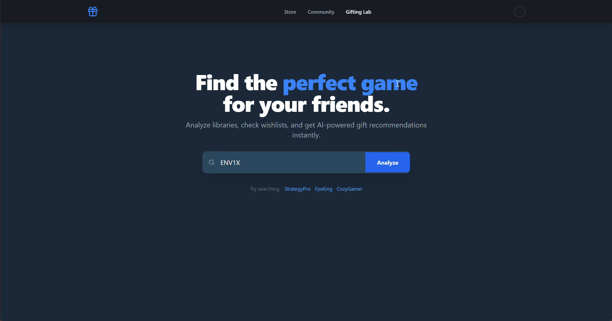

# Steam Gift Helper 🎁

A full-stack web application that helps you find the perfect gift for your Steam friends. By analyzing a user's Steam library and wishlist, it uses an algorithm to recommend games based on their actual playtime habits, favorite genres, and current desires.



## Features

* **Steam Profile Analysis:** Fetches real-time data including owned games, playtime, and account status.
* **Smart Recommendations:** Suggests gifts based on three criteria:
    * **Wishlist Priority:** Items they have explicitly asked for (sorted by date added).
    * **Genre Affinity:** High-rated games in genres they actually play (weighted by playtime).
    * **Trending:** Top-rated games that match their general gaming profile.
* **Direct Gifting:** "Gift on Steam" buttons link directly to the store page.
* **Responsive UI:** A modern, dark-themed interface built with React and Tailwind CSS.

## Prerequisites

Before you begin, ensure you have the following installed:
* [Node.js](https://nodejs.org/) (v16 or higher)
* [npm](https://www.npmjs.com/) (usually comes with Node.js)

## Setup Instructions

This project consists of two parts: a **Client** (React frontend) and a **Server** (Express backend). You need to set up both.

### 1. Get a Steam API Key
To fetch user data, you need a free API Key from Valve.
1.  Go to the [Steam Community Developer Page](https://steamcommunity.com/dev/apikey).
2.  Sign in with your Steam account.
3.  Enter a domain name (you can use `localhost` or your name) and agree to the terms.
4.  Copy your **Key**. You will need it in the next step.

### 2. Backend Setup (Server)
1.  Navigate to the server directory:
    ```bash
    cd server
    ```
2.  Install dependencies:
    ```bash
    npm install
    ```
3.  **Create your Environment File:**
    * Create a new file named `.env` inside the `server` folder.
    * Add your API Key to it like this:
        ```env
        STEAM_API_KEY=YOUR_PASTED_KEY_HERE
        ```
4.  Start the server:
    ```bash
    node index.js
    ```
    *You should see: `Server running on port 5000`*

### 3. Frontend Setup (Client)
1.  Open a **new terminal window** (keep the server running!).
2.  Navigate to the client directory:
    ```bash
    cd client
    ```
3.  Install dependencies:
    ```bash
    npm install
    ```
4.  Start the development server:
    ```bash
    npm run dev
    ```
5.  Open the link shown in your terminal (usually `http://localhost:5173`) to use the app.

## How to Use

1.  Enter a **Steam ID** or **Custom URL** (e.g., `shroud` or `76561198000000000`) in the search bar.
2.  Click **Analyze**.
3.  Review the "Gift Recommendations" cards on the left.
4.  Click **"Gift on Steam"** to go to the store page and purchase the gift.

## Troubleshooting

* **"User not found"**: Double-check the spelling. Some users have custom URLs (like `steamcommunity.com/id/fpsking`), while others only have numeric IDs.
* **"Game library is private"**: The user must have their **Game Details** set to Public in their Steam Privacy Settings. Just setting the "Profile" to Public is not enough to see playtime data.
* **"Server Error"**: Check your server terminal. If you see 403 or 401 errors, your API Key in `.env` might be incorrect.

## Tech Stack

* **Frontend:** React, Vite, Tailwind CSS, Lucide React (Icons)
* **Backend:** Node.js, Express, Axios
* **API:** Steam Web API